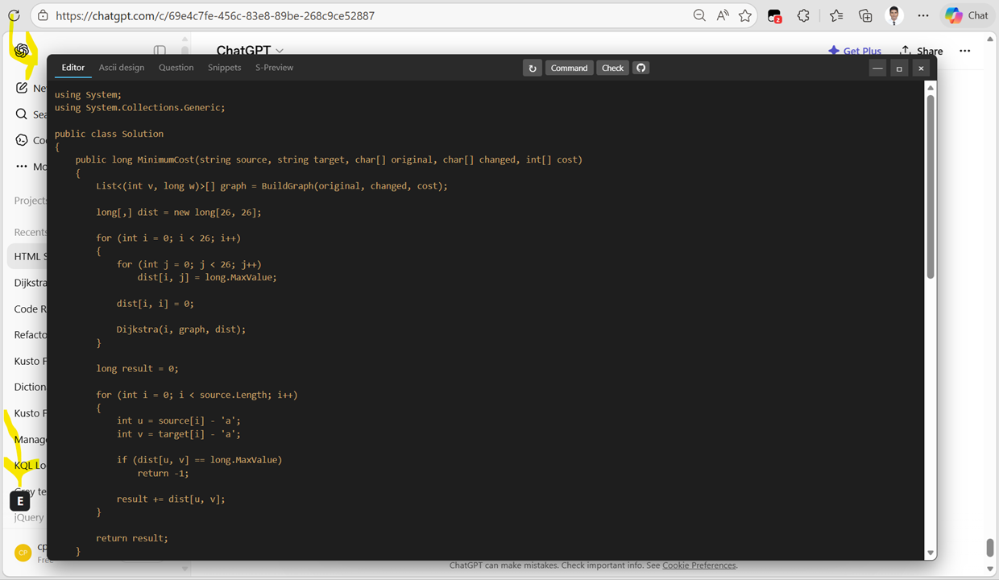

# ChatGPT Floating Scratchpad

A Tampermonkey userscript that adds a floating, resizable text editor overlay to [ChatGPT](https://chatgpt.com) with built-in prompt automation and code review.


## Features

- **Floating Editor** — A draggable, resizable scratchpad that sits on top of ChatGPT
- **Dark Theme** — Matches ChatGPT's aesthetic with a monospace code-friendly font
- **Window Controls** — Minimize, maximize, and close buttons just like a real window
- **Two-Column Layout** — When maximized, text flows into two side-by-side editable columns to use widescreen space
- **Tab System** — Five tabs: **Editor**, **Ascii design**, **Question**, **Snippets**, and **S-Preview** — switch with `Alt+1` through `Alt+5`
- **Auto-Generated Tabs** — Generated tabs (Ascii design, Question, Snippets, S-Preview) are loaded from cache on tab switch and only regenerated explicitly via `Alt+R` / the ↻ button
- **S-Preview** — Syntax-highlighted HTML preview of your code rendered in an isolated iframe with IDE-quality per-variable pastel coloring
- **Smart Caching** — Generated tab content is cached by code hash (djb2); tabs only regenerate when your code actually changes
- **Undo/Redo** — `Ctrl+Z` / `Ctrl+Y` with an in-memory stack (up to 200 entries) and debounced input capture
- **Persistent State** — Editor content, position, size, window mode, and per-tab cursor/scroll positions are saved across page reloads
- **Inline Commands** — `/p` (contextual prompt) and `/r` (raw prompt) commands to interact with ChatGPT directly from the editor
- **Code Check with Markers** — Review your code via ChatGPT; issues are marked with ⭐ at the exact position in the editor
- **Smart Indentation** — Auto-indent on Enter, Tab inserts 4 spaces, Shift+Tab removes indentation
- **Title Bar Buttons** — "↻ Regenerate", "Command", "Check", and "GitHub" buttons in the header for mouse-driven access
- **Waiting UI** — Spinner and cancel button in the titlebar while waiting for ChatGPT responses
- **LLM Job Queue** — All prompts go through a FIFO queue that processes one job at a time. Trigger several generations in a row (e.g. Alt+R on multiple tabs) and they run sequentially in the background — switching tabs does not cancel them. The Cancel button aborts the running job and flushes any queued ones.

## Installation

1. Install the [Tampermonkey](https://www.tampermonkey.net/) browser extension
2. Get the concatenated script — either:
   - Build it locally: run `./build.sh` (Linux/macOS/Git Bash) or `build.cmd` (Windows). The script is written to `dist/source.js` and copied to your clipboard. See [Building from source](#building-from-source) for details.
   - Or paste the prebuilt [`dist/source.js`](dist/source.js) directly.
3. Click **Create a new script** in the Tampermonkey dashboard
4. Paste the script contents into the editor
5. Save the script (<kbd>Ctrl</kbd>+<kbd>S</kbd>)
6. Navigate to [chatgpt.com](https://chatgpt.com) — you'll see a small **"E"** button in the bottom-left corner

## Quickstart

1. Click the **"E"** button to open the editor
2. Type `/r write a fizzbuzz boilerplate in C#` and press <kbd>Alt</kbd>+<kbd>I</kbd> — the line is replaced with generated code
3. Inside the function body, add a new line with proper indentation and type `/p fill the function`
4. Press <kbd>Alt</kbd>+<kbd>I</kbd> — ChatGPT sees the full code context and fills in the implementation
5. Press <kbd>Alt</kbd>+<kbd>C</kbd> — the code is reviewed, issues appear as ⭐ markers in the editor

## Usage

### Opening the Editor

Click the **"E"** launcher button at the bottom-left of the ChatGPT page. The floating editor window will appear.

### Window Controls

| Button | Action |
|--------|--------|
| **—** (Minimize) | Collapses the editor to just its title bar. Click again to restore. |
| **□** (Maximize) | Expands the editor to fill the entire screen with a two-column layout. Click again to restore. |
| **×** (Close) | Hides the editor. Click the "E" launcher to reopen. |

You can also **drag** the title bar to reposition the window, and **drag the bottom-right corner** to resize it.

### Two-Column Layout (Maximized)

When maximized, the editor splits into two side-by-side textareas:

- The **left column** holds as many lines as fit vertically
- **Overflow lines** appear in the **right column**
- Both columns are fully editable — click, type, select, copy/paste all work naturally
- Arrow keys cross between columns seamlessly (Down at bottom of left jumps to top of right, and vice versa)
- Backspace at the start of the right column pulls content from the left
- Lines redistribute automatically as you type or resize the window

---

### `/p` — Contextual Prompt Command

The `/p` command sends a prompt to ChatGPT **with full editor context** and replaces the command line with the response.

**How to use:**

1. In the editor, type a line starting with `/p ` followed by your prompt:
   ```
   /p write a function that adds two numbers
   ```
2. Place your cursor on that line
3. Press <kbd>Alt</kbd>+<kbd>I</kbd> or click the **Command** button in the title bar

**What happens:**
- The entire editor content is sent to ChatGPT as context, with line numbers and the `/p` line marked
- ChatGPT is instructed to respond with only the replacement text — no explanations, no fences
- The `/p ...` line is replaced with the response, preserving indentation
- The response can be multiline

**Example — building code inline:**
```
public class Calculator {
    /p write a method that divides two numbers with error handling
}
```
ChatGPT sees the full class context and generates a method that fits naturally.

---

### `/r` — Raw Prompt Command

The `/r` command sends a prompt to ChatGPT **without any context or instructions** — just the raw text.

**How to use:**

1. Type a line starting with `/r ` followed by your prompt:
   ```
   /r What is the capital of France?
   ```
2. Place your cursor on that line
3. Press <kbd>Alt</kbd>+<kbd>I</kbd> or click the **Command** button

**What happens:**
- Only the text after `/r ` is sent to ChatGPT as-is — no editor context, no system instructions
- The `/r ...` line is replaced with ChatGPT's full response

Use `/r` when you want a general-purpose question answered without the editor content influencing the response.

---

### <kbd>Alt</kbd>+<kbd>I</kbd> — Execute Current Line

<kbd>Alt</kbd>+<kbd>I</kbd> triggers the action for the current line under the cursor.

**Behavior:**
- **`/p ` line** — contextual prompt sent to ChatGPT, line replaced with response
- **`/r ` line** — raw prompt sent to ChatGPT, line replaced with response
- **Regular text** — line content is shown in an alert popup

> **Tip:** You can also click the **Command** button in the title bar instead of using the keyboard shortcut.

---

### <kbd>Alt</kbd>+<kbd>C</kbd> — Code Check

<kbd>Alt</kbd>+<kbd>C</kbd> sends the entire editor content to ChatGPT for a code review. Issues are displayed in a dialog **and** marked directly in the editor with ⭐.

**How to use:**

1. Write or paste your code into the editor
2. Press <kbd>Alt</kbd>+<kbd>C</kbd> or click the **Check** button in the title bar

**What happens:**
- The code is sent with line numbers (`1> `, `2> `, etc.) so ChatGPT can pinpoint issues
- The titlebar shows a spinner and a **Cancel** button while waiting
- ChatGPT responds with a structured review:
  - **correct** — whether the code is syntactically and logically correct
  - **solves_problem** — whether the code solves its intended problem
  - **summary** — a one-line description
  - **issues** — list of problems found
  - **suggestions** — improvement recommendations
  - **markers** — issue locations with corrected line content
- The result is displayed in a formatted dialog
- ⭐ markers are inserted into the editor at the exact position of each issue (by diffing the original line against ChatGPT's corrected version)

**Marker behavior:**
- ⭐ markers appear inline in the code right where the issue is
- **Click on a marker** or **move the cursor to it** (arrow keys) to dismiss it
- Old markers are automatically cleared before each new code check

```
Correct: ✅ Yes
Solves the problem: ❌ No

Summary:
  Implements FizzBuzz but misses the edge case for n=0

Issues:
  1. No handling for n <= 0

Suggestions:
  1. Add input validation for non-positive numbers
```

> If ChatGPT doesn't return valid JSON, the raw response is shown as a fallback.

---

### Title Bar Buttons

Two action buttons sit beside the "Editor" label in the title bar:

| Button | Action |
|--------|--------|
| **↻ Regenerate** | Clears the cache and regenerates the current tab's content — same as <kbd>Alt</kbd>+<kbd>R</kbd> |
| **Command** | Executes the current line — same as <kbd>Alt</kbd>+<kbd>I</kbd> |
| **Check** | Runs code check — same as <kbd>Alt</kbd>+<kbd>C</kbd> |
| **GitHub** | Opens the project's GitHub repository |

These work even after clicking away from the textarea — the editor remembers which textarea was last focused.

---

### Tab System

The editor has five tabs, switchable via <kbd>Alt</kbd>+<kbd>1</kbd> through <kbd>Alt</kbd>+<kbd>5</kbd>:

| Tab | Auto-generates? | Description |
|-----|-----------------|-------------|
| **Editor** (<kbd>Alt</kbd>+<kbd>1</kbd>) | — | Main code editor. Supports maximized two-column layout. |
| **Ascii design** (<kbd>Alt</kbd>+<kbd>2</kbd>) | No | Shows cached ASCII architecture diagram, or prompts you to press <kbd>Alt</kbd>+<kbd>R</kbd> to (re)generate. Read-only. |
| **Question** (<kbd>Alt</kbd>+<kbd>3</kbd>) | No | Shows cached content or prompts you to press <kbd>Alt</kbd>+<kbd>R</kbd> to generate. Read-only. |
| **Snippets** (<kbd>Alt</kbd>+<kbd>4</kbd>) | No | Shows cached snippets, or prompts you to press <kbd>Alt</kbd>+<kbd>R</kbd> to generate missing/stub function implementations and generic algorithm helpers in a `class Helper`. Editable for cursor/copy convenience. |
| **S-Preview** (<kbd>Alt</kbd>+<kbd>5</kbd>) | No | Shows cached syntax-highlighted HTML preview in an iframe, or prompts you to press <kbd>Alt</kbd>+<kbd>R</kbd> to (re)generate with IDE-quality per-variable pastel coloring and WCAG AA accessible palette. |

Each generated tab caches its result by code hash (djb2). On tab switch, the cached content is shown if the hash still matches the current editor code; otherwise a hint is displayed prompting you to press <kbd>Alt</kbd>+<kbd>R</kbd> (or click ↻) to regenerate. No tab regenerates automatically. Per-tab cursor and scroll positions are preserved when switching.

---

### Example Workflow

```
/p Write a C# class for a binary search tree with insert and search methods
```

Press <kbd>Alt</kbd>+<kbd>I</kbd> — the `/p` line is replaced with a full BST implementation.

Then press <kbd>Alt</kbd>+<kbd>C</kbd> to review the generated code. Any issues appear as ⭐ markers in the code and a summary dialog.

Fix the issues, then add more prompts inline:

```
    /p add a delete method that handles all three cases
```

ChatGPT sees the full class context and generates a method that fits.

## Keyboard Shortcuts

| Shortcut | Context | Action |
|----------|---------|--------|
| <kbd>Alt</kbd>+<kbd>I</kbd> | Editor focused | Execute current line (`/p` contextual prompt, `/r` raw prompt, or alert) |
| <kbd>Alt</kbd>+<kbd>C</kbd> | Editor focused | Send editor content for code review with ⭐ markers |
| <kbd>Alt</kbd>+<kbd>R</kbd> | Any tab | Regenerate current tab (clears cache first) |
| <kbd>Alt</kbd>+<kbd>1</kbd>–<kbd>5</kbd> | Any | Switch tabs: Editor, Ascii design, Question, Snippets, S-Preview |
| <kbd>Ctrl</kbd>+<kbd>Z</kbd> | Editor tab | Undo |
| <kbd>Ctrl</kbd>+<kbd>Y</kbd> | Editor tab | Redo |
| <kbd>Tab</kbd> | Editor focused | Insert 4 spaces |
| <kbd>Shift</kbd>+<kbd>Tab</kbd> | Editor focused | Remove up to 4 leading spaces from the current line |
| <kbd>Enter</kbd> | Editor focused | New line with auto-indent matching the current line |

## How It Works

The script injects a floating editor UI into ChatGPT's page. When you trigger a command:

1. The script snapshots the current number of assistant messages
2. The prompt text is inserted into ChatGPT's input box and sent
3. It waits for a **new** assistant message to appear (count increases)
4. It waits for ChatGPT's **stop button to disappear** (streaming complete)
5. After a short grace period, the final response text is captured
6. Code blocks are cleaned — language labels and copy buttons are stripped, line breaks are preserved
7. The original command line in the editor is replaced with the response, inheriting the line's indentation

All editor state (content, position, size, window mode) is persisted in `localStorage`.

## Building from source

The script is split into per-component files under [`src/`](src) and concatenated by a small Go-based build tool. There are **no JavaScript dependencies** — Go is the only build-time requirement (install from [go.dev/dl](https://go.dev/dl/)).

```
./build.sh        # Linux / macOS / Git Bash
build.cmd         # Windows
go run build.go   # any OS, if Go is on PATH
```

The build tool:

1. Concatenates `src/header.js` → `src/framework.js` → `src/component_*.js` (sorted) → `src/footer.js` into a single IIFE.
2. Writes the result to `dist/source.js`.
3. Copies the same content to the system clipboard (via `clip.exe` on Windows, `pbcopy` on macOS, `wl-copy`/`xclip`/`xsel` on Linux).

`node --check dist/source.js` is a quick syntax sanity-check before pasting into Tampermonkey.

### Repository layout

```
src/
  header.js                   # ==UserScript== banner + IIFE open
  framework.js                # global state + framework_init()
  framework_scrollbars.js     # framework-level scrollbar styling
  framework_kiosk.js          # kiosk-mode bootstrap reader (calls component_kiosk)
  component_kiosk.js          # auto-open + maximize when properties.kiosk = true
  component_launcher.js       # the "E" button
  component_window.js         # floating window: header, drag, resize, min/max/close, master createEditor()
  component_editor.js         # shared editor keydown (auto-indent, Tab, Ctrl+Z/Y dispatch)
  component_columns.js        # two-column layout for maximized mode
  component_tabbar.js         # tab switching + per-tab cursor/scroll state
  component_yieldframe.js     # yieldFrame() helper (await two rAFs)
  service_undoredo.js         # custom undo/redo stack
  component_waitingui.js      # spinner + Cancel button (Cancel flushes the LLM queue)
  service_dialog.js           # generic modal dialog service (reusable)
  service_llm.js              # ChatGPT DOM automation + submitMessage(prompt, onstart, onend)
                              #   FIFO queue, one job at a time + flushLlmQueue()
  component_linecommand.js    # /p, /r commands + global hotkey dispatcher
  component_codecheck.js      # Alt+C review with ⭐ markers
  component_tab_ascii.js      # ASCII diagram tab
  component_tab_question.js   # Question tab
  component_tab_snippets.js   # Snippets tab
  component_tab_spreview.js   # S-Preview tab (iframe + srcdoc)
  footer.js                   # framework_init() + IIFE close
build.go                      # concatenator (Go stdlib only)
build.sh, build.cmd           # one-line wrappers
run_app.go                    # standalone launcher (chrome + DevTools injection)
appsettings.json              # config for run_app.go (chrome path/port, properties)
dist/source.js                # generated — the file you paste into Tampermonkey
```

`ChatGPT Floating Scratchpad.js` at the repo root is the **legacy monolith** kept for reference. Edit files under `src/` instead and rebuild.

## Standalone launcher (`run_app.go`)

For an automated, kiosk-style experience there is a Go launcher that:

1. Reads `appsettings.json` (chrome path, debug port, properties).
2. Launches Chrome with `--remote-debugging-port` against `chatgpt.com` using a dedicated `chrome-profile/` directory.
3. Waits for the page to finish loading, injects a centered "booting" splash via the Chrome DevTools Protocol.
4. Feeds every key under `properties` into `window.localStorage` over the WebSocket connection.
5. Injects `dist/source.js` into the page.
6. Removes the booting splash.

Run it with:

```
go run run_app.go
```

### `appsettings.json`

```json
{
  "chromepath": ["C:\\Program Files\\Google\\Chrome\\Application"],
  "chromeport": 9222,
  "properties": {
    "kiosk": true
  },
  "app": "chrome"
}
```

- `chromepath` — list of candidate directories (or full binary paths) — the first one that exists wins. `chrome.exe` is appended automatically on Windows; `Google Chrome` on macOS; `chrome` on Linux.
- `chromeport` — desired DevTools port. If unbindable, an OS-assigned free port is used.
- `properties` — arbitrary key/value pairs written into `localStorage` before `source.js` is injected. Strings are stored as-is; non-strings are JSON-encoded (booleans become `"true"`/`"false"`).

### Kiosk mode (`properties.kiosk`)

When `properties.kiosk` is `true`, the script's `framework_init()` calls `handle_kiosk()` (in `src/framework_kiosk.js`), which:

1. Opens the floating editor automatically (no need to click the **E** launcher).
2. Maximizes it (two-column layout) if it isn't already.

This gives you a one-command launch: run `go run run_app.go` and the editor is up and ready against ChatGPT.

## Technical Details

- **Vanilla JS** — No runtime dependencies, no frameworks, ~2200 lines after concatenation
- **Runtime** — Executes at `document-idle` via Tampermonkey
- **Storage** — Uses `localStorage` for editor content, window state, and per-tab caches:
  - `tm_editor_content` — Editor text
  - `tm_editor_window_state` — Window geometry, mode, previousBounds
  - `tm_ascii_cache`, `tm_question_cache`, `tm_snippets_cache`, `tm_spreview_cache` — Tab caches
- **ChatGPT Integration** — Interacts with ChatGPT's DOM using `querySelector` on `#prompt-textarea` and `[data-testid="send-button"]`
- **Two-Column Layout** — Two real `<textarea>` elements with automatic line redistribution based on viewport height
- **Tab Caching** — Each generated tab stores `{ hash, content }` using djb2 hashing to detect code changes and avoid redundant ChatGPT calls
- **S-Preview** — Uses an iframe with `srcdoc` and `sandbox="allow-same-origin"` for isolated rendering

## Limitations

- Depends on ChatGPT's current DOM structure — may break if ChatGPT updates its UI selectors
- Response detection uses polling, not event-based hooks
- Only works on `chatgpt.com`
- Code check marker accuracy depends on ChatGPT returning minimally corrected lines

## Contributing

Contributions are welcome! Feel free to open issues or submit pull requests.

## License

This project is open source. See the repository for license details.

## Screenshot


